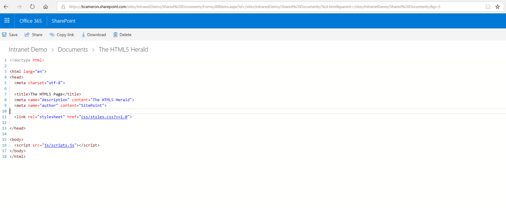

## html-editor

Upload the .sppkg file to your tenant and deploy the command set to your list. It will auto append &p=5 to the urls for editing html files.

Recently Microsoft has removed the ability to edit HTML files in SharePoint libraries. So I have created this extension. When you select a HTML file in your library, this commandbar item will show up, allowing you to click "Edit HTML". This will load the modern AllItems.aspx display view, but append &p=5, which loads the editor for the file. 

When clicking "Edit HTML", the modern view will load and append &p=5. Which forces SharePoint to load the edit functionality of the file.

### Building the code

Just deploy the .sppkg file from the sppkg folder to your appcatalog. Then deploy the commandset into your library.

